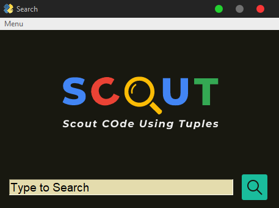

# SCoUT
Scout Code Using Tuples (SCoUT) - A school project
## About project
Made for a school project (we had to make anything mainly using tuples). Used PySimpleGUI for displaying graphical interface.
## Image

## REQUIREMENTS:
1. [Python 3](https://www.python.org/downloads/): I use 3.8.6
2. [PySimpleGUI](https://pysimplegui.readthedocs.io/): Python library for GUI development. Install it using ```pip install pysimplegui``` in Command Prompt.
## USAGE:
1. Open *'scout.py'*
2. Type anything in the search box and click the search button
3. You might want to edit the data earlier (or substitute tuples for dictionaries/sqlite dbs etc)
4. Click on one of the results that appear in the *'Search Results:'* listbox - the corresponding description will appear in the text box beside it.
5. Click *'Clear All'* in *'Menu'* to clear all fields, click *'Change Logo'* to change the logo to Google's logo.
6. Click special in the *'Menu'* to get free bitcoins [experimental]

\
\
[](https://opensource.org/licenses/MIT)<br>
Made with :heart: by Meghraj Goswami<br>
For Terms of Service visit https://bit.ly/3aeIVfl
